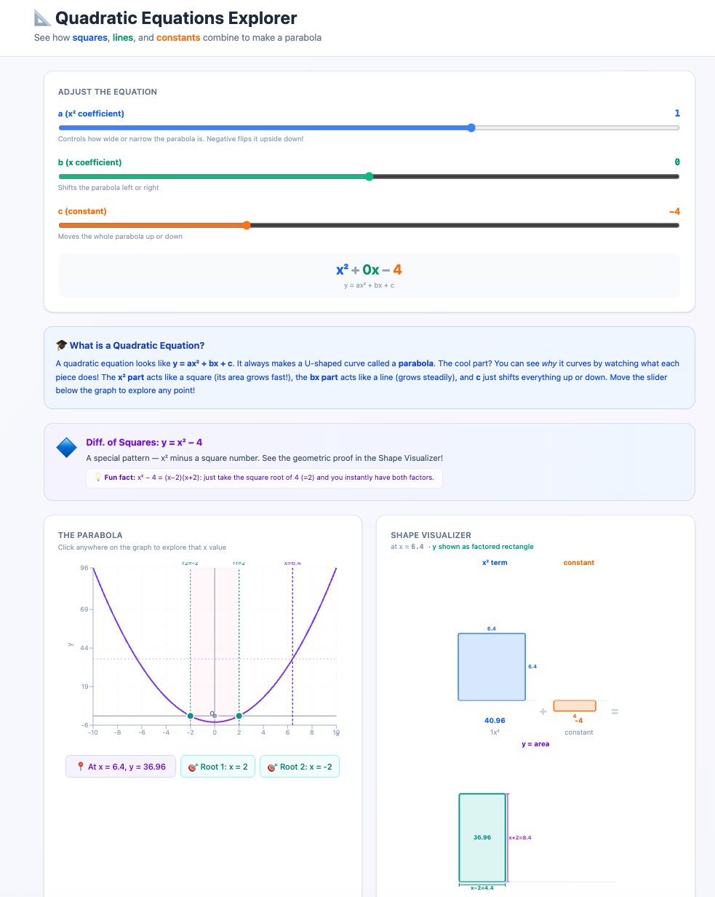

<div align="center">

# Quadratic Equations Explorer

### An interactive maths app that helps students see how quadratics work

<p>
  
</p>

<p>
  <strong>Graph it.</strong>
  <strong>Move it.</strong>
  <strong>Factor it.</strong>
  <strong>Understand it.</strong>
</p>

<p>
  <a href="https://naklih.github.io/quadratic/"><strong>Open the live demo</strong></a>
</p>

</div>

---

## The Idea

Quadratic Equations Explorer is a visual learning tool built to make `y = ax² + bx + c` easier to understand.

Instead of treating quadratics as a list of steps to memorise, this project turns them into something students can explore. The core idea is that the expression is built visually:

- `x²` is shown as a square
- `x` is shown as a rectangle
- the constant is shown as added area
- all of the pieces combine to make the full quadratic

From there, the app connects that combined shape to factorisation. Students can see that the same quadratic can be rearranged as a single rectangle whose breadth and height are the factors, so factorisation becomes a geometric structure instead of a symbolic trick.

Learners can adjust coefficients, watch the parabola respond in real time, inspect points on the curve, and connect algebra to shapes, area, and factorisation.

It is especially useful for classrooms, tutoring, and independent revision where understanding matters more than rote procedure.

## Why It Stands Out

| Traditional approach | This project |
| --- | --- |
| Memorise rules | Explore patterns |
| Follow fixed steps | Test ideas interactively |
| Solve symbolically | Connect symbols to graphs and shapes |
| Learn factorisation as a trick | Understand factorisation as structure |

## Built For Teachers And Students

### For teachers

- Use it as a live classroom demo
- Show how changing `a`, `b`, and `c` affects the graph
- Introduce roots and factorisation visually
- Support discussion instead of only instruction

### For students

- Experiment with sliders and see immediate results
- Explore guided examples
- Build intuition for parabolas and roots
- Understand why the algebra works

## What Students Can Explore

- Interactive controls for `a`, `b`, and `c`
- Real-time parabola graph updates
- Guided examples of common quadratic patterns
- Point-by-point exploration with a draggable `x` value
- Shape-based visualisations where `x²` appears as a square and `x` appears as a rectangle
- How the square term, rectangle term, and constant combine into one quadratic expression
- Factorisation shown as a rectangle whose breadth and height are the two factors

## Learning Journey

```text
equation -> graph -> pattern -> factorisation -> roots -> understanding
```

That progression is the real goal of the project.

Students should be able to say:

> Now I can see why the curve moved.  
> Now I can see where the roots come from.  
> Now factorisation actually makes sense.

## Project Vision

This repo is trying to make maths feel visible.

The goal is not just to help someone get the answer. The goal is to help them understand what the equation is doing, why the graph has its shape, and how symbolic methods connect to something they can actually see.

More specifically, the project is trying to show that:

- `x²` can be understood as a square
- `x` can be understood as a rectangular strip
- these pieces combine into the quadratic expression
- the same expression can be seen as one larger rectangle
- the breadth and height of that rectangle are the factors

That is the bridge between algebra, geometry, and graphing that the app is trying to make clear.

If it helps a teacher create that moment of clarity in a classroom, it is doing the right job.

## Tech Stack

<div align="center">

| React | Vite | Recharts | Tailwind CSS |
| --- | --- | --- | --- |

</div>

## Run Locally

```bash
npm install
npm run dev
```

Then open the local Vite URL in your browser.

---

<div align="center">
  Built for curious learners, thoughtful teachers, and better maths intuition.
</div>
